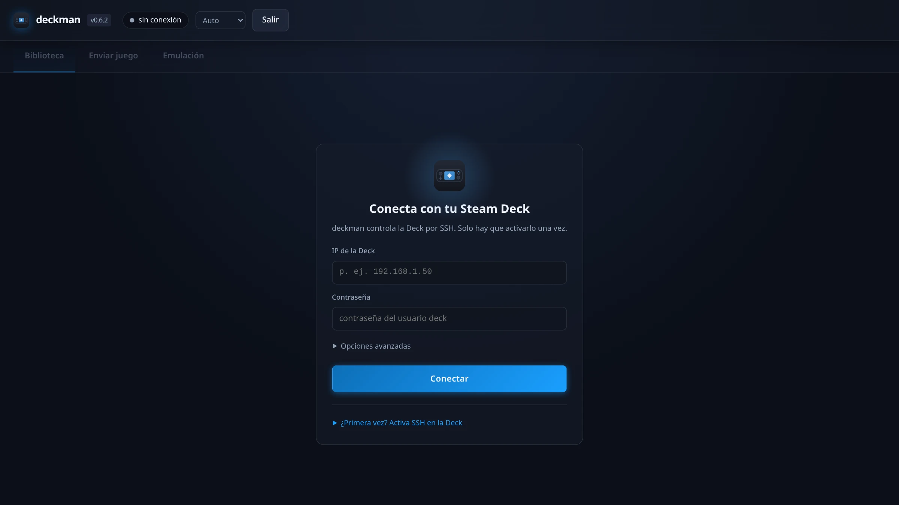
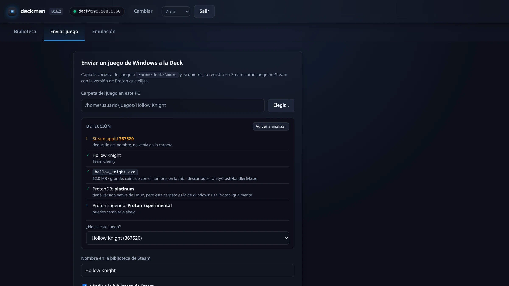
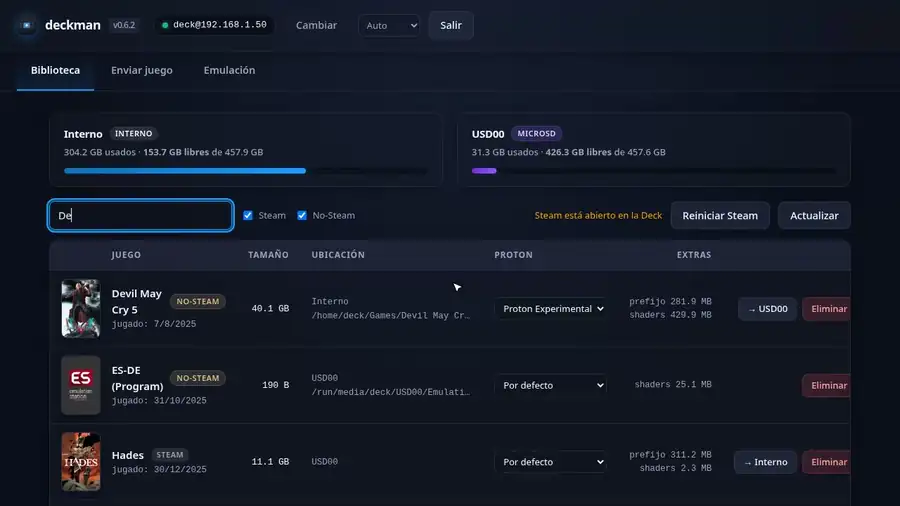
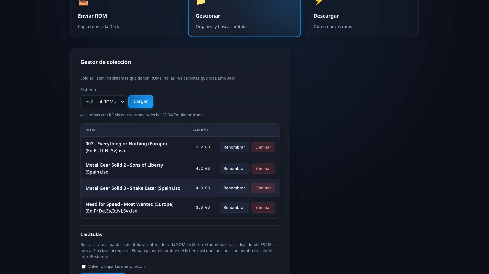
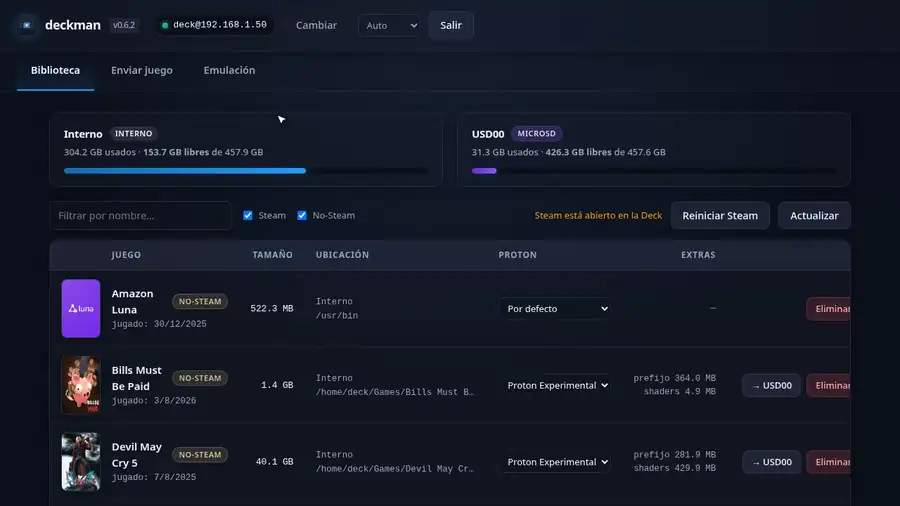
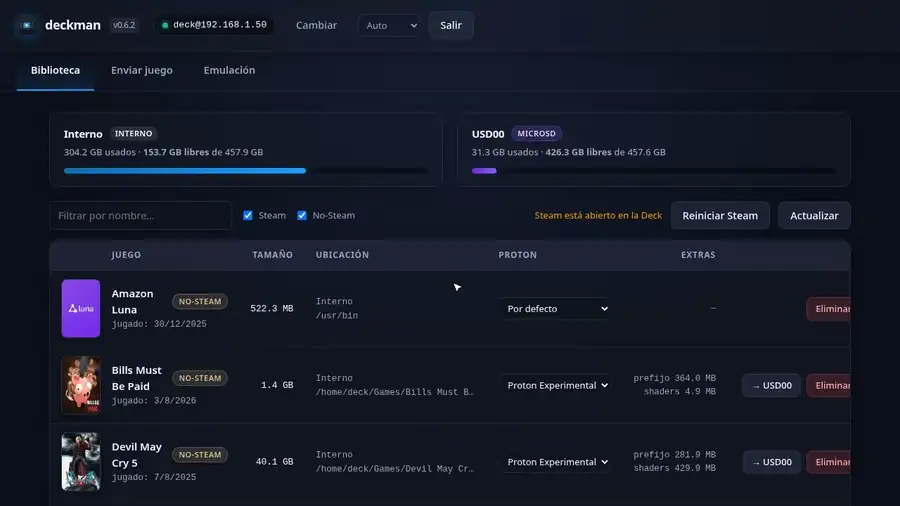

# deckman

***Español** · [English](README.en.md) · [Français](README.fr.md)*

Gestiona los juegos de tu Steam Deck desde el ordenador: ver qué hay instalado,
enviar juegos de Windows y ROMs, cambiar carátulas, mover juegos entre el SSD
interno y la microSD, y liberar espacio.


Es **un solo ejecutable**. Doble clic y se abre la interfaz en el navegador.
No hay que instalar nada, ni en el PC ni en la Deck.

- `deckman.exe` — Windows
- `deckman` — Linux (binario suelto o **Flatpak**, ver abajo)

**[Descargar la última versión](https://github.com/jfrmorales/deckman/releases/latest)**
— los binarios de cada versión están en *Releases*, con un `SHA256SUMS` para
comprobarlos:

```sh
sha256sum -c SHA256SUMS
chmod +x deckman-*-linux-amd64
```

Desde la 0.6.2, ese `SHA256SUMS` va **firmado**. El `sha256sum` de arriba dice
que lo descargado no viene corrupto; la firma dice además que lo publiqué yo y
no alguien que se hiciera con el acceso a las *Releases*:

```sh
cosign verify-blob --key cosign.pub --bundle SHA256SUMS.bundle SHA256SUMS
```

Tiene que decir `Verified OK`. `cosign.pub` y `SHA256SUMS.bundle` están en la
misma release; la clave pública es siempre la misma, así que si te la guardas
la primera vez, notarás si algún día cambia. La firma queda además anotada en
el registro público de transparencia de Sigstore, que es lo que le pone fecha.

También va un `deckman-<versión>.cdx.json`: el inventario de lo que lleva
dentro el binario, por si algún día hace falta saber si te afecta un aviso de
seguridad.

La interfaz habla **castellano, inglés y francés**. Por defecto sigue al
navegador, y hay un selector en la barra superior.

---

## Qué hace

| | |
|---|---|
| **Biblioteca** | Todos los juegos, de Steam y no-Steam, con su portada, su tamaño real, dónde están y cuánto ocupan el prefijo de Proton y la caché de shaders. Un clic en la portada abre la galería de carátulas. |
| **Enviar juego** | Copia una carpeta de juego de Windows a `~/Games` y lo registra en Steam, con la versión de Proton que elijas. |
| **Autodetección** | Al elegir la carpeta, deduce qué juego es, cuál de los `.exe` lo arranca y qué Proton conviene. |
| **Carátulas** | Galería de SteamGridDB para elegir portada, fondo, logo e icono de cualquier juego, con vista previa. Se aplican al instante. |
| **Emulación** | Copia ROMs a la carpeta del sistema correspondiente de EmuDeck; lista lo que ya hay en cada sistema —solo los que tienen juegos, no las 181 carpetas de EmuDeck— para renombrarlo o borrarlo; y descarga ROMs por URL (la descarga la hace la Deck, no el PC) con un buscador de archive.org acotado al sistema elegido. |
| **Carátulas de ROMs** | Busca carátula, pantalla de título y captura de cada ROM en libretro-thumbnails y las deja donde ES-DE las busca. Sin clave ni registro. |
| **Mover** | Traslada un juego entre el interno y la microSD sin volver a descargarlo. También los no-Steam: se lleva la carpeta y actualiza el acceso directo. |
| **Limpiar** | Desinstala juegos y borra por separado el prefijo de Proton o la caché de shaders. |

---

## Así se ve

La primera pantalla pide la IP de la Deck y la contraseña, y solo la primera
vez: a partir de ahí entra con su propia clave SSH.



Al elegir la carpeta de un juego de Windows, deckman deduce de qué juego se
trata, cuál de los `.exe` lo arranca y qué versión de Proton conviene:



Un clic en la portada abre la galería de SteamGridDB — portada vertical,
horizontal, fondo, logo e icono. Se aplican al instante, sin reiniciar Steam:



De la emulación se ve lo que ya hay en cada sistema de EmuDeck, con solo los
sistemas que tienen juegos, para renombrarlo o borrarlo:



Y hay un buscador de archive.org acotado al sistema elegido. La descarga la
hace la Deck, no el PC:



La biblioteca se filtra por nombre y se puede quedar solo con los juegos de
Steam o solo con los no-Steam:



---

## Antes de empezar

En la Deck, una sola vez:

1. Modo escritorio.
2. **Ajustes del sistema → Escritorio → Compartir → SSH**, actívalo.
   (O en una terminal: `sudo systemctl enable --now sshd`.)
3. Si nunca has puesto contraseña al usuario `deck`, ponla con `passwd`.
   SteamOS viene sin contraseña y SSH no deja entrar así.

## Uso

Ejecuta el binario. Se abre la interfaz **en una ventana propia**, como
cualquier aplicación de escritorio:

- **Windows**: ventana nativa (WebView2, el motor de Edge, que viene de serie
  en Windows 10 y 11). Cerrar la ventana cierra deckman.
- **Linux**: ventana de aplicación del navegador Chromium que haya (Chrome,
  Chromium, Brave, Edge, Vivaldi; también instalados como Flatpak). Cerrar la
  ventana cierra deckman — salvo que haya una transferencia en marcha, que se
  termina en segundo plano antes de apagarse.
- Si no hay nada de eso, se abre como pestaña en el navegador de siempre
  (`http://127.0.0.1:8777`) y deckman se cierra con el botón **Salir**.

La primera pantalla es la de conexión: la IP de la Deck, la contraseña, y en
**Opciones avanzadas** el usuario, el puerto SSH si no son los de serie
(`deck` y `22`) y un nombre para distinguirla. La propia pantalla incluye los
pasos para activar SSH si es la primera vez.

**No hay ninguna contraseña predefinida.** `deck` es el nombre de usuario
habitual de SteamOS, no una contraseña. Al conectar, deckman genera una clave
SSH propia y la deja instalada en la Deck, y por eso a partir de ahí no vuelve
a pedirte nada. La contraseña **no se guarda en ningún sitio**. La clave queda
identificada como `deckman@<tu-pc>` en el `~/.ssh/authorized_keys` de la Deck.

### Varias Decks

Las Decks a las que te conectas se van guardando y aparecen en la pantalla de
conexión: un clic para entrar en cualquiera, y **+ Añadir otra Deck** para dar
de alta una nueva. Todas comparten la misma clave SSH, que identifica a este PC.

**Olvidar** hace lo que dice: además de quitarla de la lista, **retira de esa
Deck la clave SSH**, así que este PC deja de tener acceso. Si la Deck está
apagada no se puede retirar en ese momento, y deckman lo dice en vez de callarlo
— te indica qué línea borrar a mano. Al olvidar la última Deck se borra también
la clave de este PC.

```
deckman -port 9000      # otro puerto
deckman -browser        # pestaña del navegador en vez de ventana propia
deckman -no-browser     # no abrir interfaz (solo el servidor)
deckman -version        # (en Windows no imprime: el .exe va sin consola)
```

Si se abre deckman dos veces, la segunda detecta a la primera y abre otra
ventana contra ella, sin duplicar el servidor.

La configuración se guarda en `~/.config/deckman` (Linux) o
`%AppData%\deckman` (Windows).

Para salir vale con cerrar la ventana; el botón **Salir** de la barra superior
hace lo mismo y es la única vía cuando la interfaz va en una pestaña.

---

## Flatpak (Linux)

En Linux deckman también se puede instalar como Flatpak, con icono en el menú
de aplicaciones. Bájate el `.flatpak` de
**[la última versión](https://github.com/jfrmorales/deckman/releases/latest)** y:

```sh
flatpak install deckman-0.2.3.flatpak
```

Al instalarlo, flatpak avisa de que el origen no está firmado: es lo normal en
un fichero descargado a mano. Para comprobar que es el bueno está el
`SHA256SUMS` de la release.

Si prefieres compilarlo tú (hace falta podman o docker):

```sh
make flatpak
```

Ese script compila el binario (con `./build.sh`, en contenedor), construye el
paquete con `org.flatpak.Builder` (que es a su vez un Flatpak: no instala nada
en el sistema) y lo deja instalado para el usuario. Después:

```sh
flatpak run io.github.jfrmorales.deckman     # o desde el menú: deckman
```

Detalles del sandbox:

- **Config**: va a `~/.var/app/io.github.jfrmorales.deckman/config/deckman`.
  La primera vez, si existe `~/.config/deckman` (del binario suelto), se copia
  sola: la conexión, la clave SSH y la clave de SteamGridDB se conservan.
- **Discos**: el explorador ve el home, `/run/media`, `/media` y `/mnt` en solo
  lectura. Si guardas los juegos en otro sitio, dale acceso con
  `flatpak override --user --filesystem=/tu/ruta:ro io.github.jfrmorales.deckman`.
- **Ventana**: la abre el navegador Chromium del host vía `flatpak-spawn`
  (permiso `--talk-name=org.freedesktop.Flatpak` del manifiesto). Sin ninguno
  compatible, cae a pestaña por el portal.
- Si se lanza dos veces, la segunda instancia detecta la primera y abre el
  navegador contra ella en vez de arrancar otro servidor.

---

## Enviar un juego

Eliges la carpeta y deckman intenta averiguar el resto solo:

1. **El identificador de Steam, de la propia carpeta.** Muchos repacks dejan un
   `steam_appid.txt` o un `steam_emu.ini` con el appid real. Es exacto e
   instantáneo, y no depende de acertar con el nombre.
2. **Si no lo hay, por el nombre.** Limpia el de la carpeta
   (`Resident.Evil.4.REPACK-FitGirl` → `Resident Evil 4`) y lo busca en la
   tienda de Steam. Si acierta mal, eliges otro de los resultados.
3. **El ejecutable.** Ordena los `.exe` por tamaño, parecido con el nombre y
   dónde están, y descarta la morralla: desinstaladores, `vc_redist`, informes
   de fallos, trainers, selectores de idioma. Hace falta afinar: en Resident
   Evil 4 el segundo `.exe` más grande es `CrashReport.exe`, con 151 MB.
4. **La versión de Proton**, según lo que reporta ProtonDB. *Platinum* y *gold*
   van a Proton Experimental; *silver*, *bronze* y *borked* a GE-Proton si lo
   tienes instalado.
5. **Las carátulas**, si has configurado SteamGridDB.

Todo es una propuesta: los campos quedan rellenos pero editables. Si un
servicio no responde, el envío sigue adelante igual.

**Las transferencias se pueden reanudar**: si se corta una copia, vuelve a
lanzarla y se salta lo que ya esté.

---

## Carátulas

Las sirve **SteamGridDB**, que pide una clave gratuita: entra en
`steamgriddb.com` → tu perfil → *Preferences* → *API*, y pégala en
**Enviar juego → Ajustes de carátulas**. Se guarda solo en este PC. Sin ella
todo lo demás funciona igual, pero el juego saldrá con un recuadro gris.

Dos formas de usarla:

- **Automática** al enviar un juego nuevo: coge la primera de cada tipo.
- **Eligiendo tú**: pulsa la **portada** de cualquier fila de la biblioteca.
  Pestañas de portada vertical, portada horizontal, fondo, logo e icono, con un
  punto verde en las que ya tienen imagen. Un clic abre una **vista previa** a
  tamaño grande con las medidas, el autor y lo que pesa; desde ahí se aplica o
  se cancela.

La miniatura de la biblioteca es la que enseña Steam: primero el arte que hayas
elegido tú, y si no la portada de la tienda. Un juego no-Steam sin arte sale con
su inicial en un recuadro.

Funciona con **cualquier** juego, de Steam o no. En los de Steam la
correspondencia es exacta; en los no-Steam se busca por nombre y puedes
corregirlo con el desplegable de arriba a la derecha.

Cuidado con los títulos repetidos: "Resident Evil 4" son dos juegos distintos
en SteamGridDB, el de 2005 y el remake de 2023, y la búsqueda devuelve antes el
viejo. Si ves poco arte o ninguna animada, mira ese desplegable.

**Animadas**: la casilla *Incluir animadas* las trae (portadas y fondos; logos
e iconos no tienen) y salen las primeras porque son minoría. Pesan bastante: un
fondo animado de 3840×1240 ronda los 45 MB.

**Se ven al instante, sin reiniciar Steam.** La única excepción son los iconos,
que Steam no admite cambiar en caliente.

---

## El explorador de carpetas

Como el selector del navegador nunca entrega la ruta real de una carpeta,
deckman trae el suyo. Funciona como el de cualquier escritorio:

- **Barra lateral** con la carpeta personal, Descargas, Escritorio, Documentos,
  la última usada y las unidades externas que estén montadas de verdad.
- **Migas de pan** pulsables: se salta a cualquier tramo de la ruta.
- **Escribir o pegar una ruta** con el botón ✎.
- **Filtro** para carpetas con mucho contenido.
- **Un clic selecciona, doble clic entra.** Sin nada marcado, el botón usa la
  carpeta en la que estás.
- **Teclado**: ↑ ↓ para moverse, Enter para entrar o elegir, Retroceso para
  subir, Escape para cerrar, y cualquier letra empieza a filtrar.

Al elegir el ejecutable, los `.exe` salen resaltados. Al elegir carpeta, los
ficheros se ven en gris en vez de esconderse: así se distingue una carpeta
vacía de la que buscabas.

---

## Cosas que conviene saber

**La primera conexión con una Deck recuerda su clave SSH**, sin preguntar nada.
A partir de ahí, si esa dirección contesta con otra clave, deckman **se planta**
y enseña las dos huellas en vez de conectar. Reinstalar SteamOS cambia esa clave
de forma legítima: en ese caso, aceptar el aviso y ya está. Si no has hecho nada
parecido, no aceptes — quien conteste ahí puede no ser tu Deck, y conectar le
entregaría la contraseña. Las claves recordadas viven en `known_hosts`, dentro
de la carpeta de configuración de deckman; olvidar una Deck se lleva la suya.

**Añadir juegos con Steam abierto es seguro**, pero solo porque se hace por la
API de Steam. Steam guarda la lista de accesos directos **en memoria** y
reescribe `shortcuts.vdf` al salir: editar ese fichero por detrás mientras
Steam corre no solo se pierde, sino que puede dejarte con menos juegos de los
que tenías. Por eso, si Steam está abierto pero no responde, deckman **se niega
a seguir** en vez de arriesgarse; y antes de escribir ese fichero comprueba que
no desaparece ningún juego que no tocaba.

**Steam tiene que estar cerrado para mover o desinstalar juegos de Steam.**
Mantiene su estado en memoria y reescribe los manifiestos al salir: si se mueven
los ficheros con Steam abierto, deshace el cambio y deja el juego marcado como
no instalado. deckman lo comprueba y se niega, en vez de dejarlo a medias.

**Mover un juego no-Steam sí funciona con Steam abierto**, porque ahí no hay
manifiesto que valga: se copia la carpeta a la otra unidad y se le pide a Steam
que apunte el acceso directo al sitio nuevo. Dos detalles:

- Solo se ofrece para los juegos que están en una carpeta `Games` (los que envía
  deckman). Un acceso directo a un emulador o a Heroic lanza algo que vive
  fuera, y moverlo no arreglaría nada.
- **El prefijo de Proton no se mueve.** Steam lo crea siempre en la biblioteca
  principal, así que llevárselo a la microSD dejaría las partidas guardadas
  donde Steam no las busca.

**El botón Reiniciar Steam** está en la barra de la biblioteca. En modo juego
Steam corre bajo `steam-launcher.service`, así que se reinicia esa unidad y
vuelve solo en unos segundos. En modo escritorio solo se puede cerrar; hay que
reabrirlo a mano. En ambos casos se cierra cualquier juego en marcha, por eso
pide confirmación.

**Antes de tocar cualquier fichero de configuración de Steam se deja una copia**
junto al original, con la extensión `.deckman.bak`.

**Consultas a internet**: la detección usa la tienda de Steam, ProtonDB y
SteamGridDB, enviando solo el nombre o el appid del juego. Nada más sale del PC.
**No se usa SteamDB**: no tiene API pública y sus términos no permiten rascar
la web.

---

## Compilar

Hace falta podman o docker. **No se instala Go en el sistema**:

```sh
make setup    # una vez: comprueba requisitos y deja el clon listo
make build    # los dos binarios en dist/
```

`make` a secas lista todo lo que se puede hacer.

### Pruebas

```sh
make check    # locales
make deck     # + integración contra tu Steam Deck
make audit    # análisis estático y vulnerabilidades conocidas
```

`make audit` va aparte de `make check` a propósito: mira contra una base de
datos que cambia sola, así que puede ponerse en rojo sin que nadie haya tocado
nada. Eso está bien para enterarse — el CI la pasa en cada push — pero sería
pésimo como puerta de publicar.

La IP y la contraseña van en `deck.local.env` (lo crea `make setup` a partir
del ejemplo), junto con la clave de SteamGridDB si quieres probar las carátulas.
Ese fichero **no se versiona** — este repositorio es público.

Las de integración **no tocan la configuración real**: montan un árbol de Steam
de mentira en `~/deckman-selftest` de la Deck y lo borran al terminar. Las
pocas que por fuerza tienen que tocar Steam (arte en caliente) restauran lo que
había.

Las pruebas locales usan muestras en `testdata/`, no versionadas por contener
identificadores de la cuenta de Steam. Para generarlas:

```sh
scripts/fetch-testdata.sh 192.168.1.50
```

Sin ellas, esas pruebas se saltan solas.

### Versiones

Los cambios se anotan en **[CHANGELOG.md](CHANGELOG.md)** bajo *No publicado*, y
se publican con una sola orden:

```sh
make release V=0.2.0
```

Comprueba, mueve lo pendiente a la versión nueva, actualiza el metainfo del
Flatpak, crea el tag `v0.2.0`, lo empuja a todos los remotos verificando que
llega a cada uno, y reinstala el Flatpak — para que no vuelva a quedarse
desfasado respecto al código.

Es reversible mientras se pueda: si algo falla **antes** de publicar, deshace
el commit y el tag y te deja como estabas. Si ya había salido a algún remoto no
reescribe historia publicada; te dice el estado de cada uno y qué falta.

La versión sale de un único sitio, el tag, y se puede consultar en cualquier
momento:

```sh
deckman --version                                  # binario suelto
flatpak run io.github.jfrmorales.deckman --version # Flatpak
flatpak list --columns=application,version | grep deckman
```

El repositorio vive en dos sitios y se mantienen sincronizados:
[GitHub](https://github.com/jfrmorales/deckman) y un Forgejo propio.

---

## Documentación

- **[docs/ARQUITECTURA.md](docs/ARQUITECTURA.md)** — cómo está organizado el
  código y por qué se tomaron las decisiones que se tomaron.
- **[docs/HALLAZGOS-STEAM.md](docs/HALLAZGOS-STEAM.md)** — cómo funciona Steam
  por dentro. Nada de esto está documentado por Valve: se averiguó a mano
  contra una Deck real, y son las trampas que hicieron fallar cosas.
- **[CHANGELOG.md](CHANGELOG.md)** — qué cambió en cada versión.
- **[CONTRIBUTING.md](CONTRIBUTING.md)** — cómo compilar, probar y mandar
  parches.

---

## Contribuir

Los fallos y los parches son bienvenidos: lee
**[CONTRIBUTING.md](CONTRIBUTING.md)**, que explica cómo compilar (solo hace
falta podman o docker), cómo correr las pruebas contra una Deck de verdad y las
dos reglas que no se saltan porque saltárselas borra juegos de la gente.

---

## Licencia

**GPL-3.0-or-later** — ver [LICENSE](LICENSE). Puedes usarlo, estudiarlo,
modificarlo y redistribuirlo; si distribuyes una versión modificada, tiene que
ir también con el código y con esta misma licencia.
